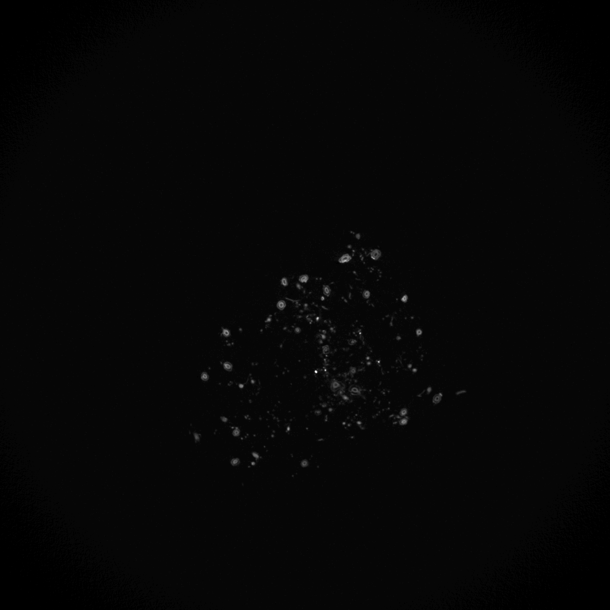
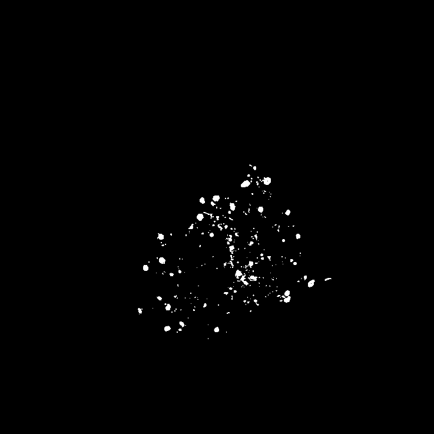
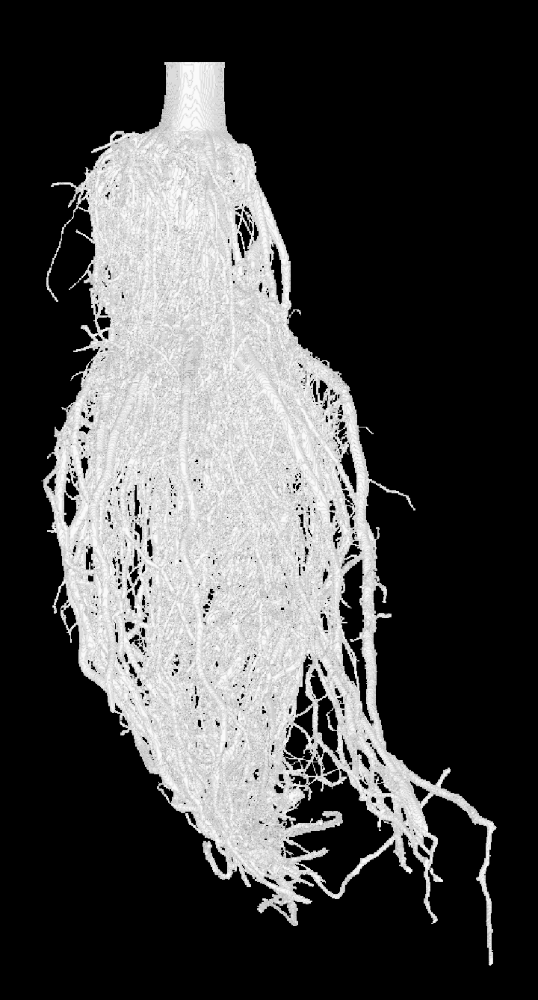
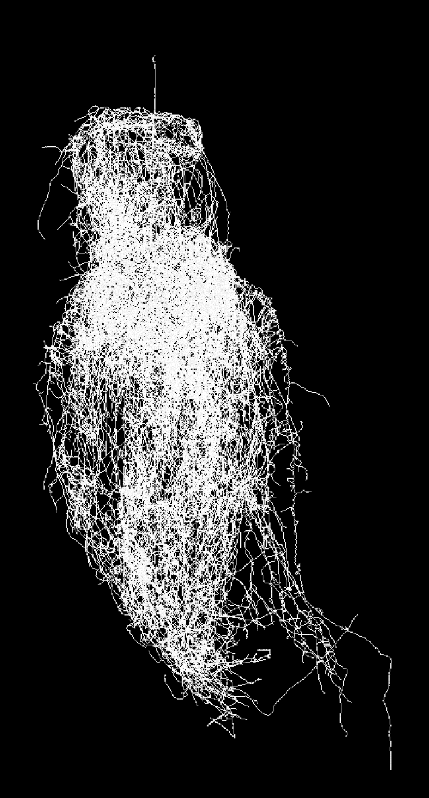
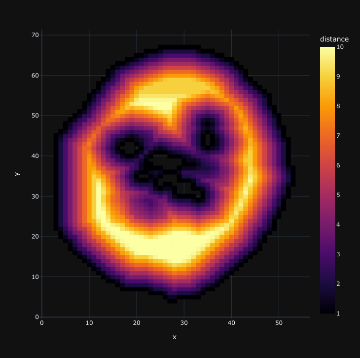
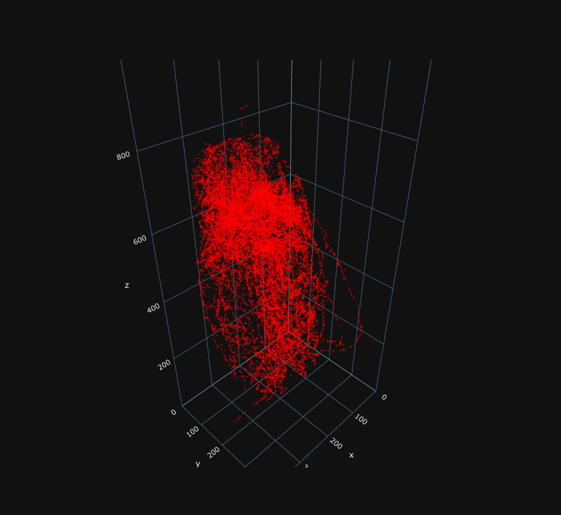
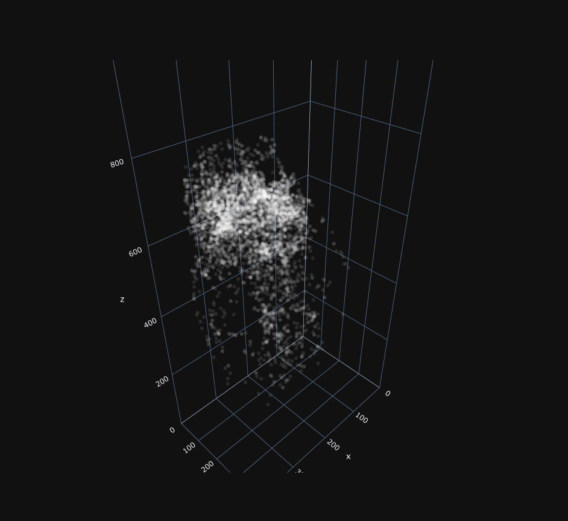
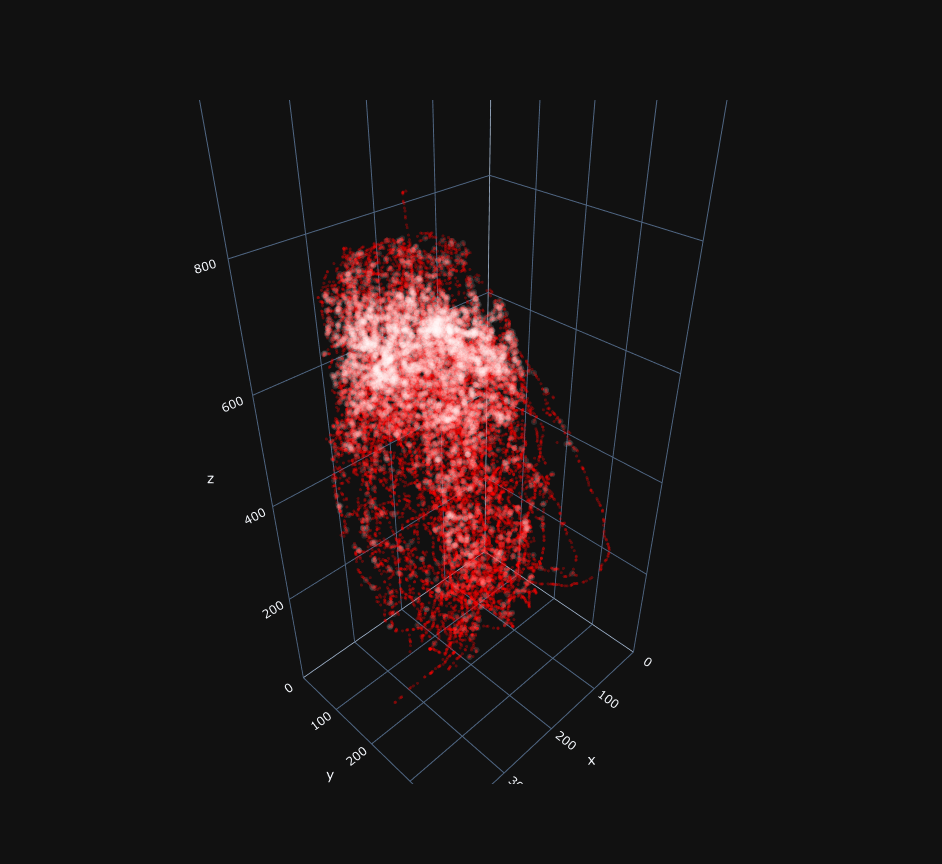

# Implementation

This document provides more technical descriptions of data ingest, internal data structures, and how each trait is calculated.

## Data and How It's Represented

The input for this pipeline typically starts with a `.raw` X-ray scan. It should be an **unsigned 16-bit byte sequence**. By convention, the object of interest (root crown) is oriented such that the stalk is near the "top" of the volume and root tips towards the "bottom" of the volume. It's highly recommended to follow this convention. Keep in mind that if you choose to invert your input data, you will need to account for that when interpreting your resultant phenotypes.

<div align="center">
    <a href="docs/img/preview-side-projection.png"></a>
</div>

Above is an example of what an orthographic side projection of a `.raw` volume.

In order to get meaningful information from our sample, the data has to be in the transformed into an appropriate format. It starts out as the aforementioned `.raw` format that should be accompanied by a `.dat` that contains important metadata about its resolution. The resolution can be equated to the real-world dimensions of each byte or "voxel" in its counterpart `.raw`. The `.dat` is not strictly necessary for this pipeline, but it does help for interpreting the results.

Our first transformation of the data is to split it into slices and segment it. For details on usage, see [usage](USAGE.md) documentation. However, to summarize the first two steps in the pipeline, `raw2img` and `batch-segmentation`, they split the `.raw` into many uint8 `.png` horizontal grayscale slices. Each grayscale slice is converted into a uint8 `.png` binary slice. In addition, segmentation will produce a `.out` and `.obj`. These are point cloud representations of the same binary slices. The `.out` is used by [Gia3D] and the binary `.png` files are used by [rootCrownImageAnalysis3D]. See below for an example of a grayscale horizontal slice (left) and a binary slice (right).

<div align="center">
    <a href="docs/img/preview-grayscale-slice.png"></a>
    <a href="docs/img/preview-binary-slice.png"></a>
</div>

The binary slices are self-explanatory and are used by both rootCrownImageAnalysis3D and New3DTraitsForRPF. The point cloud data is used by Gia3D, and how it's used by Gia3D benefits from explanation. Each vertex in the point cloud is converted to a voxel, and therefore has volume. Internally, the point cloud is stored as a hashmap whose key-value pair is xyz-coordinates to a value. Although this provides important information about our root system, we can apply thinning to it to create a skeleton for even more information. See below for an exmple of a root model (left) and its counterpart skeleton model (right). These are orthographic screenshots taken in Meshlab.

<div align="center">
    <a href="docs/img/preview-root-model.png"></a>
    <a href="docs/img/preview-skeleton-model.png"></a>
</div>

The figure on the left is the point cloud data represented by voxels. This is often referred to as the root model, root system, or point cloud data. The last alias is a bit of a misnomer, but I'll explain shortly. The figure on the right is the skeletonized version of the root model; often referred to as the skeleton (model). Both are stored and manipulated as hashmaps. The root model maps coordinates to volume. The skeleton maps coordinates to erosion distance with respect to the root model's surface.

The reason why "point cloud data" is a misnomer for the voxelized data is because of how the point cloud data is preprocessed before measurement. The `.out` file is loaded directly as the root model but is immediately "repaired". This act of repairing the point cloud data attempts to find the **largest single connected component**&mdash;effectively removing any floating artifacts left behind from segmentation. This process does so by finding all connected components from the point cloud data, joining them, and closing any cavities. Once the root model is repaired, it calculates a Euclidean distance transform map as seen below.

<div align="center">
    <a href="docs/img/dtmap_slice_example.png"></a>
</div>

This figure shows a single horizontal (i.e., cross-sectional) slice of a stalk. The stalk was selected because it is perpendicular to our view, so we can see straight down the length of it. The lighter, yellow color indicates a farther distance from an edge, and in contrast, the darker the color, the shorter the distance to an edge. Keep in mind that this happens in 3D space, not just within the edges of the slice. If you're curious, the gaps within the stalk are air pockets. This particular sample had been desiccated before scanning.

Now we have our root model, and it's ready for measurement. However, we haven't quite created a skeleton of it. We first copy the root model and work on that. To create the a skeleton, we apply thinning to a copy of our root model and then scale its axes appropriately. This applies a thinning algorithm developed by Patrick Min. Said algorithm simply erodes boundary voxels of the object without changing its topology. The method described by Kálmán Palágyi and Attila Kuba in _Directional 3D Thinning Using 8 Subiterations_, Springer-Verlag Lecture Notes in Computer Science volume 1568, pp. 325-336, 1999.

Erosion distances are computed during the thinning algorithm; they are estimated by the number of the iterations which it takes to erode the shape until one-voxel wide curve remains. This information is important some downstream estimations.

**Done!** Or, we finally have all the fundamental data structures needed for [Gia3D] to measure its traits:

1. Root model
1. Distance transform map
1. Skeleton
1. Erosion distances

## Measuring and Calculating Traits

Given the nature of a pipeline, the underlying submodules/packages/components have been developed as different projects and are therefore spread across a few repositories. These are [3d-root-crown-analysis-pipeline](README.md) (this repo), [Gia3D], [New3DTraitsForRPF], and [rawtools]. The associated code base that implements each trait is identified along side its description.

> **Note**: Since these traits were developed over the years by many contributors, conventions are **not** consistent. One inconsistency that stands out is the orientation of our axes in 3D space. Most often, Y represents the depth of the volume and starts at the stalk-side of the volume at 0. As you move towards the root tips, the value of Y increases. The X and Z axes represent the 2D coordinates within a horizontal slice.
>
> That being said, this is not true for all code bases, so if you review the source code for any of the underlying modules, make sure to deouble check its documentation and conventions.

### SurfaceArea

Count of exposed faces of root model. Implemented by [Gia3D].

```text
Input: A set of voxels, I, containing each voxel's respective coordinates.
Output: Count of exposed faces as total surface area, S.
Let v denote the current voxel.
Let n denote a neighboring voxel's coordinates along one of the primary axes of V. I.e., each voxel with coordinates (x±1, y, z), (x, y±1, z) and (x, y, z±1) is connected to v at (x, y, z).

PROCEDURE measureSurfaceArea:
    Set S to 0.

    For each v in I:
        For each neighbor, n:
            If n is *not* in I:
                Increment S by 1.
   Return S.
END
```

### Volume

Count of voxels that represent a root model. Implemented by [Gia3D].

```text
Input: A set of voxels, I, containing each voxel's respective coordinates.
Output: Count of voxels as total volume, V.

PROCEDURE measureVolume:
    Set V to size/cardinality of I.

    Return V.
END
```

### ConvexVolume

Total volume of a convex hull that contains the root model, computed by qhull library (v2012.1). Implemented by [Gia3D]. For details, see C. Bradford Barber, David P. Dobkin, & Hannu Huhdanpaa (1996). The Quickhull algorithm for convex hulls. _ACM TRANSACTIONS ON MATHEMATICAL SOFTWARE, 22(4), 469–483._ [doi:10.1.1.117.405](http://citeseerx.ist.psu.edu/viewdoc/summary?doi=10.1.1.117.405).

### Solidity

The ratio of the volume to the convex hull volume. Implemented by [Gia3D].


### MedR

The 50th percentile of the number of connected components for all slices. The number of connected components represents the number of roots that intersect a given horizontal slice. Implemented by [Gia3D].

```text
Input: A set of voxels, I, containing each voxel's respective coordinates.
Output: The median count of roots that intersect the XZ plane, a horizontal slice along the y-axis.
Let v denote the current voxel.
Let n denote the number of connected components.
Let S denote a horizontal slice along the y-axis.
Let y0 denote the earliest y-coordinate with a non-empty voxel.
Let yf denote the last y-coordinate with a non-empty voxel.
Let D denote the depth, yf - y0 + 1. This is a count of the slices needed to enclosure all slices with non-empty voxels.

PROCEDURE measureMedianRootCount:
    Create an empty list, R.

    For each slice along the y-axis, S:
        Set n to 0.
        For each voxel, v, with a y-coordinate equal to S:
            Create a connected component, c, using a 26-neighbor search path.
            Increment n by 1.
        Set the Sth element of R equal to n.

    Sort R, ascending order.
    If D is odd:
        Return the (D/2) element of R.
    Else:
        Return the average of the elements, (D/2) and (D/2)-1, of R.
END
```

### MaxR

The 84th percentile of the number of connected components for all slices. The number of connected components represents the number of roots that intersect a horizontal given slice. Implemented by [Gia3D].

```text
Input: A set of voxels, I, containing each voxel's respective coordinates.
Output: The 84th percentile count of roots that intersect the XZ plane, a horizontal slice along the y-axis.
Let v denote the current voxel.
Let n denote the number of connected components.
Let S denote a horizontal slice along the y-axis.
Let y0 denote the earliest y-coordinate with a non-empty voxel.
Let yf denote the last y-coordinate with a non-empty voxel.
Let D denote the depth, yf - y0 + 1. This is a count of the slices needed to enclosure all slices with non-empty voxels.

PROCEDURE measureMaximumRootCount:
    Create an empty list, R.

    For each slice along the y-axis, S:
        Set n to 0.
        For each voxel, v, with a y-coordinate equal to S:
            Create a connected component, c, using a 26-neighbor search path.
            Increment n by 1.
        Set the Sth element of R equal to n.

    Sort R, ascending order.
    Set i to ⌊D*0.85⌋.

    Return the ith element of R.
END
```

### Bushiness

The ratio of MaxR to MedR. Implemented by [Gia3D].


### Depth

The difference in the number of voxels between the first slice and the deepest slice.
The slices are 0-indexed, so 1 is added. Implemented by [Gia3D].

```text
Input: A set of voxels, I, containing each voxel's respective coordinates.
Output: The count of the slices needed to enclosure all slices with non-empty voxels.
Let y0 denote the earliest y-coordinate with a non-empty voxel.
Let yf denote the last y-coordinate with a non-empty voxel.

PROCEDURE measureDepth:
    Set y0 to the number of voxels + 1.
    Set yf to 0.

    For each v in I:
        If y0 is larger than the y-coordinate of v:
            Set y0 to the y-coordinate of v.
        If yf is smaller than the y-coordinate of v:
            Set yf to the y-coordinate of v.

    Return yf - y0 + 1
END
```

### HorEqDiameter

Maximum root model width among all horizontal slices. Implemented by [Gia3D].

```text
Input: A set of voxels, I, containing each voxel's respective coordinates.
Output: The maximum width between all extreme points of all horizontal slices along the y-axis.

PROCEDURE measureMaximumWidth:
    Set maxWidth to 0.

    For each slice along the y-axis, S:
        Create an empty list, P.
        For each v in S:
            Add v to P.

        Set width, w, to 0.

        If the length of P is less than 2:
            Set w to 0
        If the length of P is 2:
            Set w to the Euclidean distance between the two elements of P.
        If the length of P is greater than 2:
            Set A to the area of the convex hull of all elements of P.
            Set w to 2√(A/π);

        If w is greater than maxWidth:
            Set maxWidth to w.

    Return w
END
```

### TotalLength

Count of voxels that represent a skeleton of the root system (i.e., skeleton model). Implemented by [Gia3D].

```text
Input: A set of voxels, I, containing each voxel's respective coordinates in the skeleton.
Output: Count of voxels as length, L.

PROCEDURE measureTotalLength:
    Set L to size/cardinality of I.

    Return L.
END
```

### SRL

Ratio of total root length to volume (i.e., **V**olume). Implemented by [Gia3D].


### Length_Distr

The ratio of root length in the upper 1⁄3 of the skeleton to the root length in the lower 2⁄3 of the skeleton. Implemented by [Gia3D].

```text
Input: A set of voxels, I, containing each voxel's respective coordinates for the skeleton.
Output: The ratio between the top ⅓ and bottom ⅔ of the depth.
Let y0 denote the lowest value for any y-coordinate for all voxels.
Let D denote the depth, as defined above.

PROCEDURE measureLengthDistribution:
    Set the cutoff threshold, c, to y0 + ⌊D/3⌋.
    Set upper length, U, to 0.
    Set lower length, L, to 0.

    For each v in I:
        If the y-coordinate of v is less than c:
            Increment U by 1.
        Else:
            Increment L by 1.

    If L is 0:
        Return L
    Else:
        Return U/L
END
```

### W_D_ratio

The ratio of the HorEqDiameter to the depth. Implemented by [Gia3D].


### NumberBifCl

The number of connected components made up of neighboring branches in the skeleton. Implemented by [Gia3D].

This trait effectively counts the number of branching points in the root model. It uses the skeleton as the basis for this. To visualize what this means, see the figures below. Full disclosure, these models were *downsampled* point cloud representations, as the full resolution is far too dense to distinguish a cluster from branch by eye.

<div align="center">
    <a href="docs/img/skeleton.png"></a>
    <a href="docs/img/bifurcation-clusters.png"></a>
    <a href="docs/img/bifurcation-clusters_overlay_skeleton.png"></a>
</div>

- The left figure shows the skeleton.
- The center figure shows a large, transparent bubble in the area of any bifurcation cluster.
- The right figure shows the bifurcation clusters overlaid onto the skeleton.

Notice that the density of white bubbles is relatively lower the closer to the root tips. This suggests that there is less frequent branching relative to the regions closer to the stalk.

For details on how bifurcation clusters are identified and counted, see pseudocode below.

```text
Input: A set of voxels, I, containing each voxel's respective coordinates for the skeleton.
Output: Count of bifurcation clusters

PROCEDURE countBifurcationClusters:
    Create an empty list of clusters, C.

    Identify instances of branching
        Create an empty list of branching points, B.

        For each voxel, v in I:
            If more than 2 voxels neighbor v:
                Add v to B.


    Merge neighboring branches into a single cluster (i.e., connected component):
        Initialize a queue, Q.
        While B is not empty:
            Add first element of B to Q.
            Create empty list of branch voxels, Bv.
            
            While Q is not empty:
                Dequeue the next element, e, of Q.
                Add e to Bv.
                Remove e from B.
                For each neighbor n, of e:
                    If n is in B:
                        Add n to Q.
                        Remove n from B.

            Add Bv to C.
    Return number of elements in C
END
```

### AvgSizeBifCl

The total number of voxels for all connected components of neighboring branches divided by the number of bifurcation clusters. I.e., the average number of voxels for each bifurcation cluster (connected component with more than two neighboring voxels/branches). Implemented by [Gia3D].

```text
Input: A set of voxels, I, containing each voxel's respective coordinates for the skeleton.
Output: Count of bifurcation clusters

PROCEDURE measureAverageBifurcationClusterSize:
    Create an empty list of clusters, C.

    Identify instances of branching
        Create an empty list of branching points, B.

        For each voxel, v in I:
            If more than 2 voxels neighbor v:
                Add v to B.


    Merge neighboring branches into a single cluster (i.e., connected component):
        Create an empty queue, Q.
        While B is not empty:
            Add first element of B to Q.
            Create empty list of branch voxels, Bv.
            
            While Q is not empty:
                Dequeue the next element, e, of Q.
                Add e to Bv.
                Remove e from B.
                For each neighbor n, of e:
                    If n is in B:
                        Add n to Q.
                        Remove n from B.

            Add Bv to C.
    
    Count the number of voxels that are members of a bifurcation cluster
        Set cTotal to 0.
        For each cluster, c, in C:
            Add the size of c to cTotal.

    Set cCount to the number of elements in C.

    Return cTotal / cCount.
END
```

### EdgeNum

Number of edges in the skeleton. An edge is a segment of voxels joining two or more bifurcation clusters. They are a sequences of neighboring voxel. Each edge ends at a bifurcation cluster; therefore, any voxel sequence that do not branch (i.e., fewer than 3 neighbors) is omitted. Implemented by [Gia3D].

```text
Input: A set of voxels, I, containing each voxel's respective coordinates for the skeleton.
Output: Count of edges.

PROCEDURE countEdges:
    Create an empty list EDGES.

    Identify edges
        Create an empty list for non-branching voxels, NB.
        Create an empty list of branching voxels, B.

        Note, a branching voxel is a voxel with more than 2 neighbors.
        
        For each voxel, v, in I:
            If v as more than two neighbors:
                Add v to B.
            Else:
                Add v to NB.

        Create empty list S, for starting voxel for each edge.

        For each non-branching voxel, nbv in NB:
            Create an empty list E.
            Add nbv to E.
            If a neighbor of nbv is in NB:
                Add neighbor to E.
            Else if a neighbor is in B:
                Add neighbor to E.
                Add neighbor to S.
            Else:
                Add nbv to S.

            Add E to EDGES.

    Return the number of elements in EDGES.
END
```

### AvgEdgeLength

Sum of the length of all edges calculated from the skeleton divided by the number of edges. The length of each edge is the euclidean distance traversed by walking along each edge, voxel by voxel. Implemented by [Gia3D].

```text
Input: A set of voxels, I, containing each voxel's respective coordinates for the skeleton.
Output: Count of edges.

PROCEDURE countEdges:
    Create an empty list EDGES.

    Identify edges
        Create an empty list for non-branching voxels, NB.
        Create an empty list of branching voxels, B.

        Note, a branching voxel is a voxel with more than 2 neighbors.
        
        For each voxel, v, in I:
            If v as more than two neighbors:
                Add v to B.
            Else:
                Add v to NB.

        Create empty list S, for starting voxel for each edge.

        For each non-branching voxel, nbv in NB:
            Create an empty list E.
            Add nbv to E.
            If a neighbor of nbv is in NB:
                Add neighbor to E.
            Else if a neighbor is in B:
                Add neighbor to E.
                Add neighbor to S.
            Else:
                Add nbv to S.

            Add E to EDGES.

    Set edgeCount to the number of element in EDGES.

    Calculate the total distance between each element of each edge.
        Set totalEdgeLength to 0.

        For each edge, e in EDGES:
            For each voxel, ve in e:
                Starting with the starting voxel (first element of ve), calculate
                the Euclidean distance, D, to the coordinates of the element of the edge.

                Add D to totalEdgeLength.

    Return totalEdgeLength / edgeCount.
END
```

### Number_tips

Number of root tips. Implemented by [Gia3D].

```text
Input: A set of voxels, I, containing each voxel's respective coordinates for the skeleton.
Output: Count of root tips.

PROCEDURE countRootTips:
    Set tipCount to 0.

    For each voxel, v in I:
        If and only if v has one neighbor:
            Increment tipCount by 1.

    Return tipCount.
END
```

### volume

An estimated volume for the root model based on the volume of a right cylinder. Implemented by [Gia3D]. This uses the estimated number of iterations in a thinning algorithm as the radius of the cylinder. The height of each cylinder is assumed to be 1 voxel.

The number of iterations is estimated by an algorithm developed by Patrick Min. Said algorithm simply erodes boundary voxels of the object without changing its topology. The method described by Kálmán Palágyi and Attila Kuba in _Directional 3D Thinning Using 8 Subiterations_, Springer-Verlag Lecture Notes in Computer Science volume 1568, pp. 325-336, 1999.

```text
Input:
    A set of voxels, I, containing each voxel's respective coordinates for the skeleton.
    An erosion distance, E, containing the estimated number of iterations to erode root model down to a width of one voxel.
Output: Estimated volume of root model.

PROCEDURE approximateVolume:
    Set C to 0.
        
    For each voxel, v in I:
        Set r to erosion distance found in E for v.
        Add r² to C.

    Return C * π.
END
```

### Surface_area

An estimated surface area for the root model based on the surface area of the lateral surface of a right cylinder. Implemented by [Gia3D]. This uses the estimated number of iterations in a thinning algorithm as the radius of the cylinder. The height of each cylinder is assumed to be 1 voxel.

The number of iterations is estimated by an algorithm developed by Patrick Min. Said algorithm simply erodes boundary voxels of the object without changing its topology. The method described by Kálmán Palágyi and Attila Kuba in _Directional 3D Thinning Using 8 Subiterations_, Springer-Verlag Lecture Notes in Computer Science volume 1568, pp. 325-336, 1999.

```text
Input:
    A set of voxels, I, containing each voxel's respective coordinates for the skeleton.
    An erosion distance, E, containing the estimated number of iterations to erode root model down to a width of one voxel.
Output: Estimated surface area of root model.

PROCEDURE approximateSurfaceArea:
    Set C to 0.
        
    For each voxel, v in I:
        Set r to erosion distance found in E for v.
        Add r to C.

    Return C * 2π.
END
```

### av_radius

An estimated average radius for all roots for the root model. Implemented by [Gia3D]. This uses the estimated number of iterations in a thinning algorithm as the radius at each point/voxel.

The number of iterations is estimated by an algorithm developed by Patrick Min. Said algorithm simply erodes boundary voxels of the object without changing its topology. The method described by Kálmán Palágyi and Attila Kuba in _Directional 3D Thinning Using 8 Subiterations_, Springer-Verlag Lecture Notes in Computer Science volume 1568, pp. 325-336, 1999.

```text
Input:
    A set of voxels, I, containing each voxel's respective coordinates for the skeleton.
    An erosion distance, E, containing the estimated number of iterations to erode root model down to a width of one voxel.
Output: Estimated average radius for all roots in root model.

PROCEDURE approximateAverageRootRadius:
    Set C to 0.
    Set voxelCount to 0.
        
    For each voxel, v in I:
        Set r to erosion distance found in E for v.
        Add r to C.
        Increment voxelCount by 1.

    Set totalRadii to C * 2π.

    Return totalRadii / voxelCount.
END
```

### Elongation

PCA on 3D point cloud, taking the ratio between PC2 variance and PC1 variance; measures how elongated the root is. Implemented by [rootCrownImageAnalysis3D].

### Flatness

PCA on 3D point cloud, taking the ratio between PC3 variance and PC2 variance; measures how flat the root is. Implemented by [rootCrownImageAnalysis3D].

### Football

PCA on (x, y) of 3D point cloud, taking the ratio between PC2 variance and PC1 variance. Implemented by [rootCrownImageAnalysis3D].

### Biomass VHist

3D root point cloud vertical density distribution at n<sup>th</sup> cm below the top. Implemented by [New3DTraitsForRPF].

### Convex Hull VHist

Compute the convext hull for the root at each image slice first, then the trait is 3D convex hull point cloud vertical density distribution at n<sup>th</sup> cm below the top. Implemented by [New3DTraitsForRPF].

### Solidty VHist

The solidity at each slice is computed, then spline interpolated to the nt​h​ cm (1-20) below the top. Implemented by [New3DTraitsForRPF].

### DensityS

The frequency of voxels with different 6 overlap ratios from side view. S6 represents the largest overlap ratio. Higher numbers in greater overlap ratio means a denser root. Implemented by [rootCrownImageAnalysis3D].

### DensityT

The frequency of pixels with different 6 overlap ratios from top view. S6 represents the largest overlap ratio. Implemented by [rootCrownImageAnalysis3D].

### FractalDimensionS

Fractal dimension is estimated from the projected side-view image using the box-counting method. It is a measure of how complicated a root shape is using self-similarity. Implemented by [rootCrownImageAnalysis3D].

### FractalDimensionT

Fractal dimension estimated from the projected top-view image using the box-counting method. It is a measure of how complicated a root shape is using self-similarity. Implemented by [rootCrownImageAnalysis3D].

### N/CH/S Mean

Mean estimated from the distribution of biomass/volume (N), convex hull (CH), or solidity (S) along the z-axis. Implemented by [rootCrownImageAnalysis3D].

### N/CH/S Std

Standard deviation estimated from the distribution of biomass/volume (N), convex hull (CH), or solidity (S) along the z-axis. Implemented by [rootCrownImageAnalysis3D].

### N/CH/S Skewness

Skewness, or inequality, estimated from the distribution of biomass/volume (N), convex hull (CH), or solidity (S) along the z-axis. Negative value indicates that a large number of the values are lower than the mean (left-tailed); positive value indicates that a larger number of the values are higher than the mean (right-tailed). Implemented by [rootCrownImageAnalysis3D].

### N/CH/S Kurtosis

Kurtosis, or peakiness, estimated from the distribution of biomass/volume (N), convex hull (CH), or solidity (S) along the z-axis. High value indicates that the peak of the distribution around the mean is sharp and long-tailed; low value indicates that the peak around the mean is round and short-tailed. Implemented by [rootCrownImageAnalysis3D].

### N/CH/S Energy

Energy, or uniformity, estimated from the distribution of biomass/volume (N), convex hull (CH), or solidity (S) along the z-axis. A high value indicates that the distribution has a small number of different levels. Implemented by [rootCrownImageAnalysis3D].

### N/CH/S Entropy

Entropy, the inverse of energy, estimated from the distribution of biomass/volume (N), convex hull (CH), or solidity (S) along the z-axis. A high value indicates that the distribution has a higher number of different levels. Implemented by [rootCrownImageAnalysis3D].

### N/CH/S Smoothness

Smoothness estimated from the distribution of biomass/volume (N), convex hull (CH), or solidity (S) along the z-axis. Defined as . Implemented by [rootCrownImageAnalysis3D].


[Gia3D]: <https://github.com/Topp-Roots-Lab/Gia3D>
[New3DTraitsForRPF]: <https://github.com/Topp-Roots-Lab/New3DTraitsForRPF/tree/standalone-kde-traits>
[rawtools]: <https://github.com/Topp-Roots-Lab/python-rawtools>
[rootCrownImageAnalysis3D]: <https://github.com/Topp-Roots-Lab/3d-root-crown-analysis-pipeline/blob/master/xrcap/rootCrownImageAnalysis3D.py>