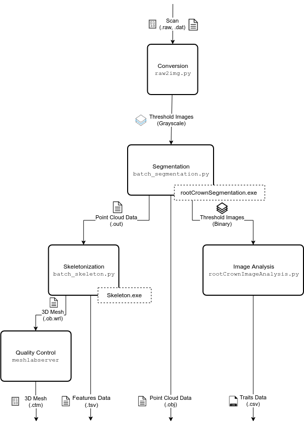

# 3-D Root Crown Analysis Pipeline

Stable version: 1.0.0

Author: Ni Jiang

Compatibility: Python 3

This set of scripts is used to analyze 3-D volumes of maize root crowns.

- [Input & Output](#input-&-output)
- [Usage](#usage)
- [Descriptions](#description)
- [Workflow](#workflow)
- [Troubleshooting](#troubleshooting)
- [Additional Information](#additional-information)
  - [Planned Development](#planned-development) \#\# Input & Output

## Input

The input data consists of a `.raw` and its paired `.dat` file. Both of these can be generated by the NorthStar Imaging (NSI) Software from exporting a `.raw` volume.

## Output

The results of this pipeline are a `.tsv` of features and a `csv` of traits calculated from the provided volume.

### Usage

An example run of the entire pipeline (omitting meshlabserver) is as follows:

```{.sourceCode .bash}
raw2img -t 8 /path/to/volume;
batch_segmentation -t 8 /path/to/volume;
batch_skeleton -t 8 /path/to/volume_3d_models;
rootCrownImageAnalysis3D -s 2 -t 0.109 -i /path/to/volume_thresholded_images
```

By convention, the sampling, denotated by `-s` flag, is set as 2. You will need to extract the slice thickness value from the `.dat` file associated with the volume. The slice thickness is the real-world thickness, in millimeters, of each slice. They should be the same for each dimension. By convention, we round the the nearest thousandth (e.g., 0.1042 -\> 0.104).

### Root Crown Analysis Pipeline Flowchart

This is an overview of the execution sequence for analyzing root crown x-ray scans.

<p align="center">
  
</p>
### Description

Below is a description of each individual module.

## Volume to Image Conversion (`raw2img.py`)

Converts the a `.raw` volume into an grayscale image stack. The volume is sliced along the Z axis, from top to bottom.

## Segmentation (`batch_segmentation.py`)

Converts the grayscale image stack into binary image stack. You have the option to remove soil if the `--soil` option is provided.

## GiA3D or Skeletonization/Mesh Generation (`batch_skeleton.py`)

Converts a point cloud representation of the root system into a 3-D mesh. Currently, this module also produces the skeleton of the root system as well.

## Analysis (`rootCrownImageAnalysis3D.py`)

Analyzes the root system based on the binary image stack and calculates traits for the root system.

### Workflow

The pipeline is installed as a system-wide tool, so you will not need to navigate to it. The following commands can be called from any location so long as you are logged in via SSH or have a terminal open on the machine. Only one step will require user input: rootCrownImageAnalysis3D, but keep in mind that additional flag/options are available to tweak how the data is processed (e.g., sampling).

1. Convert 3-D Volume to Grayscale 2-D Slices

---

**Example**

```{.sourceCode .}
raw2img -t 10 /path/to/myVolume/
```

This folder should contain the .raw and .dat files.

This script creates sub-folders for each volume with extract grayscale images for each.

Note on threads: The -t option allows you to dedicate a maximum number of CPUs dedicated to processing your data. This applies to every step but the final one, rootCrownImageAnalysis3D. For Viper, generally you do not get a performance increase beyond using 30 threads. For Ludo, we recommend using no more than 8 threads.

2. Segmentation: Create Binary 2-D Slices & Generate Point Cloud

---

Be aware that this is one of two scripts that may require input at the end of the command (when you call the script, you can type -h for “help” at the end to get more description of what the input means and what options are available). By default the sampling is set to 2; this will downsample the data by half.

**Example**

```{.sourceCode .}
batch_segmentation -t 10 /path/to/myVolume/
```

This folder should contain the .raw and .dat files. This script creates two sibling folders: /path/to/myVolume_3d_models/ and /path/to/myVolume_thresholded_images. Respectively, the first will contain point cloud data and the second will contain binary images.

#### Quality Control

Segmentation sometimes results in invalid point cloud data and binary images (stored in /path/to/myVolume_thresholded_images/). This may manifest as larger than expected point cloud data (.obj & .out) and binary images that primarily consist of white pixels.

If any point cloud data is several times larger than the median, check its respective binary images for completely white slices. If you find a large number of white slices, delete the slices that cover the same range in the grayscale images (output of raw2img), delete the generated thresholded_images folder, and then re-run this step of the pipeline.

If done correctly, batch_segmentation should run faster, if only marginally, than the last attempt and the file sizes should be more loosely uniformly distributed.

3. Generate 3-D Mesh and Skeleton

---

Run the batch_skeleton script on the desired slices folder (at this point, the scripts are sequentially run on the output of previous scripts and file path will need to include path of metadata created in the previous script)

**Example**

```{.sourceCode .}
batch_skeleton -t 10 /path/to/myVolume_3d_models/
```

This folder should contain point cloud data: .obj and .out. This script will transform the point cloud data into meshes for quality control: .wrl files.

#### Quality Control

To further verify that segmentation was performed correctly, view the generated meshes in a 3-D model viewer such as Meshlab. Generally, make sure that the mesh generated looks like a real-world root system. Look out for solid planes that slice through the mesh and doubled root tips. The latter may indicate a mishap during reconstruction with the NSI software and can be reconstructed again to salvage the sample. Check with your supervisor for specifics on quality control for the meshes.

4. Measure Traits from Binary 2-D Slices

---

This script requires additional input from the user; keep in mind that -s does not mean the same thing as in the previous script and -t requires the resolution of the scans being analyzed to follow in millimeters. For resolution in μm, move the decimal three spaces to the left. The resolution should be a part of the volume’s filename, it is also stored as the SliceThickness value in its .dat file. By convention, we round this to the nearest thousandth.

**Example**

```{.sourceCode .}
rootCrownImageAnalysis3D -s 2 -t 0.104 -i /path/to/myVolume_thresholded_images/
```

This folder should contain the binary images generated by the segmentation step. This script generates a .CSV of the measured traits for each volume.

**Done!** See below for additional information on running multiple projects in succession and available options for each script.

### Troubleshooting

If you encounter an issues, please submit a GitHub issue: <https://github.com/Topp-Roots-Lab/3d-root-crown-analysis-pipeline/issues>

### Additional Information

- Optional dependencies
- xvfb
- meshlab
- meshlabserver

```{.sourceCode .bash}
dnf install xorg-x11-server-Xvfb
```

## Planned Development

If you encounter any error, problem, or would like to suggest a feature, please submit a [git issue](https://github.com/Topp-Roots-Lab/3d-root-crown-analysis-pipeline/issues).

### Installation Guide for 3D-RCAP

## CentOS 8 Guide

Base on this CentOS 7 guide: <https://www.vultr.com/docs/how-to-install-opencv-on-centos-7>

#### Dependencies

##### System-level dependencies

```{.sourceCode .bash}
dnf install python2-devel python3-devel gcc gcc-c++
```

##### OpenCV (from Source)

###### Step 1: Install dependencies for OpenCV

```{.sourceCode .bash}
# Add Okay repo for libav-devel
dnf install http://repo.okay.com.mx/centos/8/x86_64/release/okay-release-1-3.el8.noarch.rpm
dnf install gtk3-devel gstreamer1-devel gstreamer1-plugins-base-devel libdc1394-devel libgphoto2-devel libav-devel cmake
```

###### Step 2: Download the OpenCV 3.3.0 archive

```{.sourceCode .bash}
wget https://github.com/opencv/opencv/archive/3.2.0.zip
unzip 3.2.0.zip
```

###### Step 3: Compile and install OpenCV 3.3.0

```{.sourceCode .bash}
cd opencv-3.2.0
mkdir -v build && cd build
cmake -D CMAKE_BUILD_TYPE=DEBUG -D CMAKE_INSTALL_PREFIX=/usr/local ..
make
make install
```

###### Step 4: Configure required variables

```{.sourceCode .bash}
export PKG_CONFIG_PATH=$PKG_CONFIG_PATH:/usr/local/lib/pkgconfig/
echo '/usr/local/lib/' >> /etc/ld.so.conf.d/opencv.conf
ldconfig
```

###### Step 5 (optional): Run tests

```{.sourceCode .bash}
cd
git clone https://github.com/opencv/opencv_extra.git
export OPENCV_TEST_DATA_PATH=/root/opencv_extra/testdata

# You can find several test executables named with a name similar to `opencv_test_*`
# Try one just to test that the installation was successful
cd /root/opencv-3.3.0/build/bin
ls
./opencv_test_photo
```

## Core files

```{.sourceCode .bash}
# Clone repo
git clone https://github.com/Topp-Roots-Lab/3d-root-crown-analysis-pipeline.git /opt/3drcap/
# Create symlinks in /usr/local/bin
find /opt/3drcap/rcap -type f | while read f; do ln -sv "$f" "/usr/local/bin/$(basename "${f%.*}")"; done
# Install Python modules for versions 2 and 3
pip install -r /opt/3drcap/requirements.txt
pip2 install -r /opt/3drcap/requirements.txt
```

### Ubuntu 18.04 Guide

## Dependencies

#### System-level dependencies

```{.sourceCode .bash}
apt install libopencv-core3.2 libopencv-imgcodecs3.2 python2.7 python2.7-dev python3 python3-dev gcc g++
```

## Core files

```{.sourceCode .bash}
# Clone repo
git clone https://github.com/Topp-Roots-Lab/3d-root-crown-analysis-pipeline.git /opt/3drcap/
# Create symlinks in /usr/local/bin
find /opt/3drcap/src -type f | while read f; do ln -sv "$f" "/usr/local/bin/$(basename "${f%.*}")"; done
# Install Python modules for versions 2 and 3
pip install -r /opt/3drcap/requirements.txt
pip2 install -r /opt/3drcap/requirements.txt
```

## Compile C++ Binaries

```{.sourceCode .bash}
g++ -o xrcap/lib/rootCrownSegmentation xrcap/rootCrownSegmentation.cpp -lopencv_highgui -lopencv_imgcodecs -lopencv_imgproc -lopencv_core -lboost_system -lboost_filesystem -lboost_program_options
```

### Credits

This package was created with [Cookiecutter](https://github.com/audreyr/cookiecutter) and the [audreyr/cookiecutter-pypackage](https://github.com/audreyr/cookiecutter-pypackage) project template.
