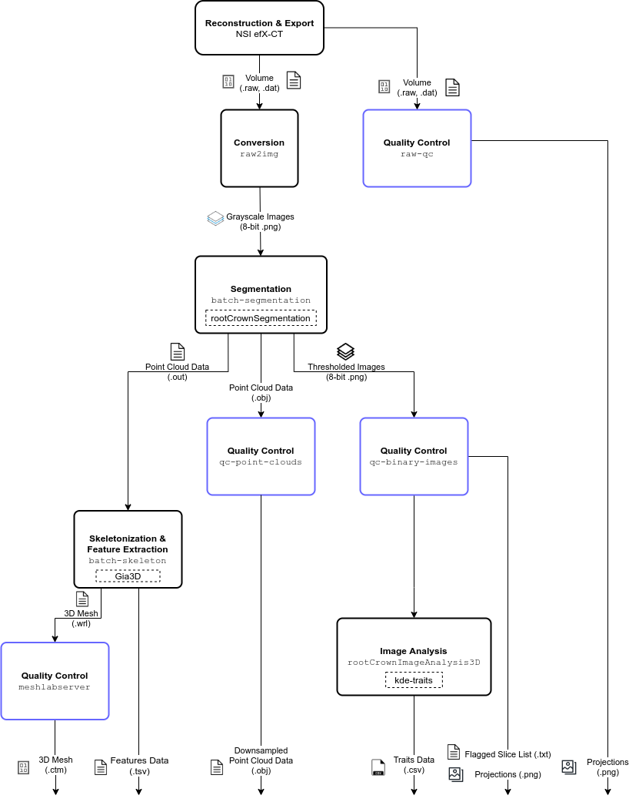

# 3-D Root Crown Analysis Pipeline

Stable version: 1.0.0

Author: Ni Jiang

Compatibility: Python 3

This set of scripts is used to analyze 3-D volumes of maize root crowns.

- [Input & Output](#input-&-output)
- [Usage](#usage)
- [Descriptions](#description)
- [Troubleshooting](#troubleshooting)
- [Additional Information](#additional-information)
 - [Ludo & Usage](#ludo-usage)
 - [Planned Development](#planned-development)
## Input & Output

### Input

The input data consists of a `.raw` and its paired `.dat` file. Both of these
can be generated by the NorthStar Imaging (NSI) Software from exporting a
`.raw` volume.

### Output

The results of this pipeline are a `.tsv` of features and a `csv` of traits
calculated from the provided volume.

## Usage

An example run of the entire pipeline (omitting meshlabserver) is as follows:

```bash
raw2img -i ./myVolume/
batch_segmentation -s 2 -i ./myVolume/
batch_skeleton -i ./myVolume_3d_models/
rootCrownImageAnalysis3D -s 2 -t 0.104 -i ./myVolume_thresholded_images/
```

By convention, the sampling, denotated by `-s` flag, is set as 2.
You will need to extract the slice thickness value from the `.dat` file
associated with the volume. The slice thickness is the real-world thickness,
in millimeters, of each slice. They should be the same for each dimension.
By convention, we round the the nearest thousandth (e.g., 0.1042 -> 0.104).

### Help
```txt
usage: raw2img.py [-h] [-v] [-V] [-i INPUT_FOLDER] [-t THREADS] [--force]
                  [-f FORMAT]
                  PATH [PATH ...]

Convert .raw 3d volume file to typical image format slices

positional arguments:
  PATH                  Input directory to process

optional arguments:
  -h, --help            show this help message and exit
  -v, --verbose         Increase output verbosity (default: False)
  -V, --version         show program's version number and exit
  -i INPUT_FOLDER, --input_folder INPUT_FOLDER
                        Deprecated. Data folder. (default: disabled)
  -t THREADS, --threads THREADS
                        Maximum number of threads dedicated to processing.
                        (default: <all CPUs>)
  --force               Force file creation. Overwrite any existing files.
                        (default: False)
  -f FORMAT, --format FORMAT
                        Set image filetype. Availble options: ['png', 'tif']
                        (default: png)
```

## Root Crown Analysis Pipeline Flowchart

This is an overview of the execution sequence for analyzing root crown x-ray
scans.

<p align="center">
  
</p>

## Description

Below is a description of each individual module.

### Volume to Image Conversion (`raw2img.py`)

Converts the a `.raw` volume into an grayscale image stack.
The volume is sliced along the Z axis, from top to bottom.

### Segmentation (`batch_segmentation.py`)

Converts the grayscale image stack into binary image stack. You have the option
to remove soil if the `--soil` option is provided.

### GiA3D or Skeletonization/Mesh Generation (`batch_skeleton.py`)

Converts a point cloud representation of the root system into a 3-D mesh.
Currently, this module also produces the skeleton of the root system as well.

### Analysis (`rootCrownImageAnalysis3D.py`)

Analyzes the root system based on the binary image stack and calculates traits
for the root system.

## Troubleshooting

If you encounter an issues, please submit a GitHub issue: https://github.com/Topp-Roots-Lab/3d-root-crown-analysis-pipeline/issues

## Additional Notes

### Ludo & Usage 

Originally, this pipeline was release on Ludo. The workflow is slightly different,
as its files are not managed by Git and as of writing this, they are stored in
`/media/topplab/EA6E84586E842005/scripts/rootCrownAnalysis3D`.

You will need to run the scripts directly with the Python interpreter to use
them on Ludo.

```bash
cd /media/topplab/EA6E84586E842005/scripts/rootCrownAnalysis3D/
python raw2img.py -i ./myVolume/;
python batch_segmentation.py -s 2 -i ./myVolume/;
python batch_skeleton.py -i ./myVolume_3d_models/;
python rootCrownImageAnalysis3D.py -s 2 -t 0.109 -i ./myVolume_thresholded_images/
```

This is a slight difference quality-of-life changes between the two instances of
the pipeline. However, the code used to calculate the values for your results are
the same.

### Planned Development

1. Extract slice thickness for rootCrownImageAnalysis3D from `.dat`

If you encounter any error, problem, or would like to suggest a feature, please submit a [git issue](https://github.com/Topp-Roots-Lab/3d-root-crown-analysis-pipeline/issues).